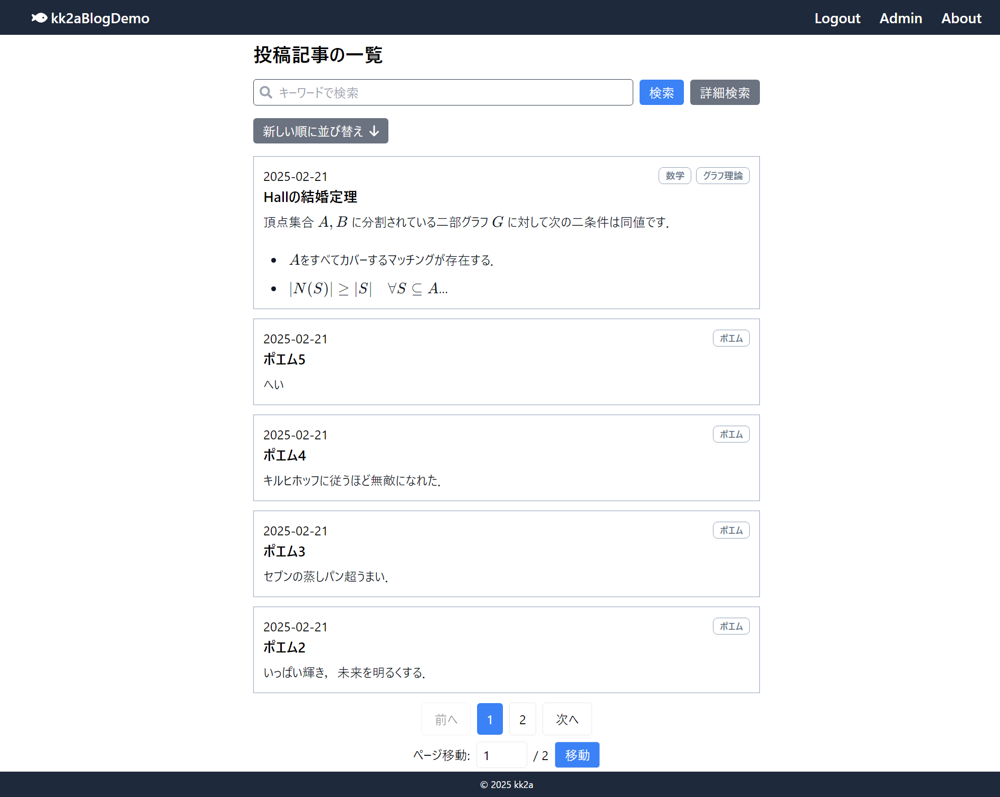
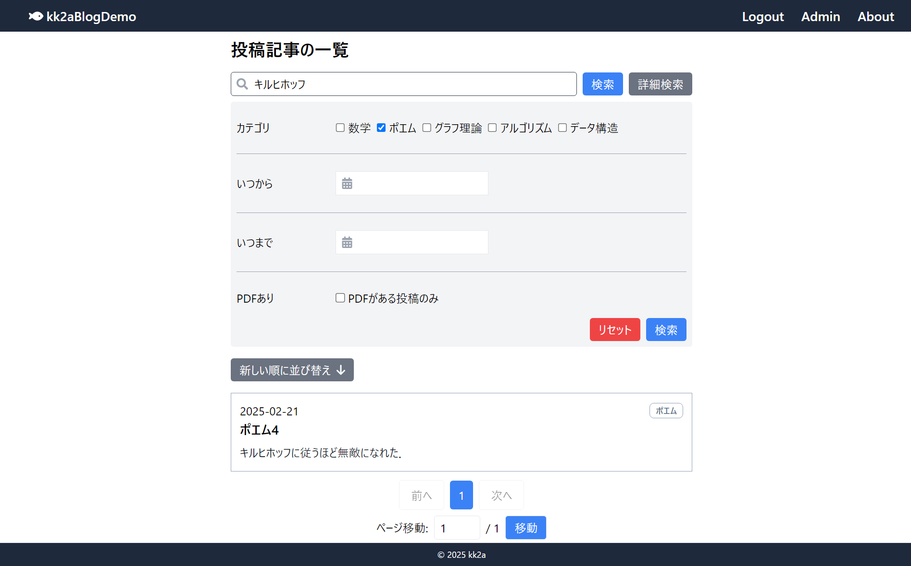
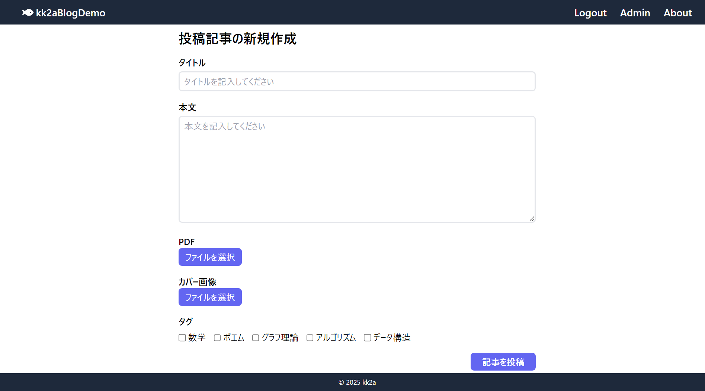
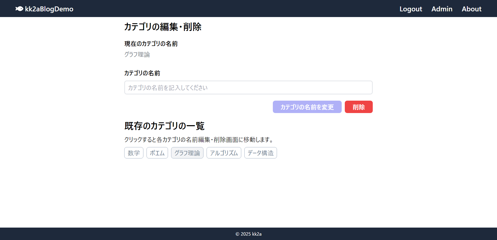
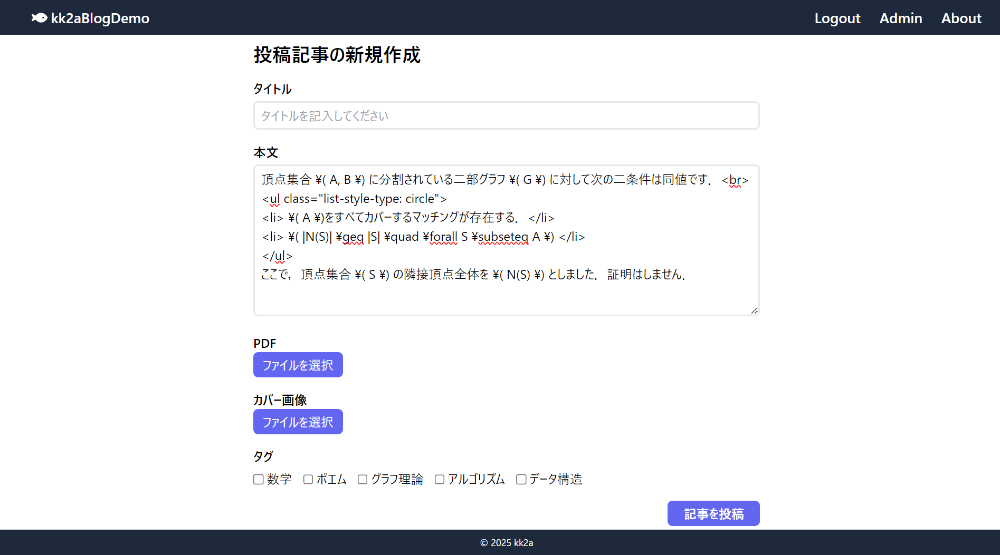
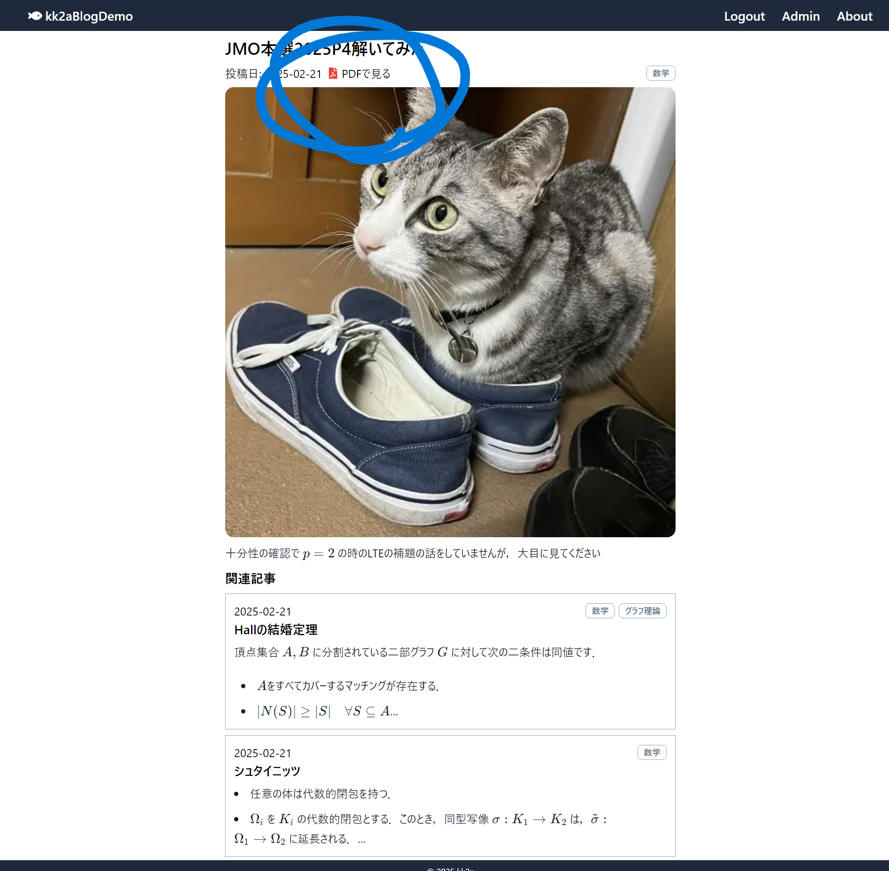
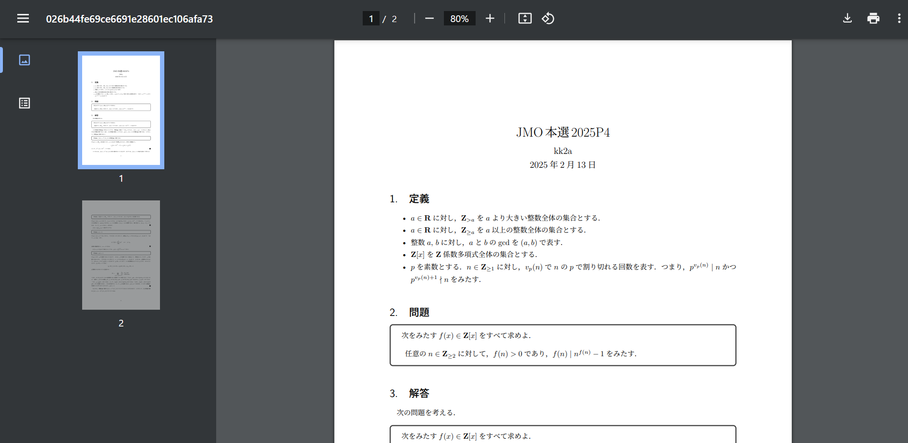
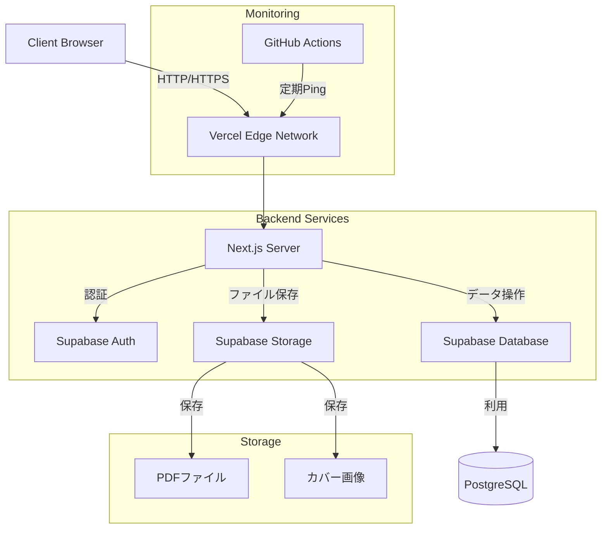

# Next.jsを用いた個人ブログアプリ

Next.jsを用いた個人ブログ専用のアプリです．情報科学分野の解説記事を中心とした，カスタマイズ可能な個人ブログプラットフォームとして開発しました．

## 開発の背景・経緯

情報科学分野の解説記事を公開したいという思いから開発をスタートしました．既存の技術ブログプラットフォームでは自分の求める自由度が得られなかったため，特にLaTeXで書いた数学的な内容をPDF形式で添付できる機能など，独自の要件を満たすブログシステムを構築することにしました．

公開URL: [https://kk2a-blog-app-demo.vercel.app/](hhttps://kk2
a-blog-app-demo.vercel.app/)

## 特徴と機能の説明

### 1. 記事管理システム

- カバーイメージ，カテゴリ，PDF添付機能付きの記事投稿
- リッチテキストエディタによるHTML形式での執筆支援
- カテゴリ管理機能

### 2. 管理者機能

ログイン情報（デモ用）:

- メールアドレス: `admin@example.com`
- パスワード: `a`

※重要な注意事項:

- セキュリティ上の理由から，実際の利用時は個人情報を入力しないでください
- このデモ環境で投稿した記事やカテゴリは全てのユーザーに公開されます
- 不適切な内容の投稿はお控えください

主な機能:

- 記事の投稿・編集・削除
- カテゴリの追加・編集・削除

### 3. 記事執筆機能

シンプルなHTMLエディタを採用し，記事の執筆環境を提供します．

- HTMLによるコンテンツ作成
- 基本的な文章装飾（見出し，リスト，リンクなど）
- コード片の挿入と装飾

※画像の挿入機能は現在サポートしていません．記事のカバー画像のみ設定可能です．

### 4. PDF添付機能

LaTeXで作成した数学的な内容をPDFとして添付可能です．数式やグラフを美しく表示できます．

## 使用技術

### フロントエンド

- TypeScript
- Next.js 14 (App Router)
- React
- Tailwind CSS
- react-katex (数式表示)

### バックエンド

- Prisma (ORM)
- Supabase
  - Authentication (メール認証)
  - Database (PostgreSQL)
  - Storage
    - PDFファイル保存
    - 記事カバーイメージの保存

### インフラ・開発環境

- Vercel (ホスティング)
- Node.js
- 開発ツール
  - VSCode
  - ESLint (コード品質管理)
  - Prettier (コードフォーマット)
  - Git/GitHub
- GitHub Actions
  - サーバーのスリープ防止の定期Ping

## システム構成図

## 開発期間・体制

- 開発体制：個人開発
- 開発期間：2024.12 ~ 2025.2 (約40時間)

## 工夫した点

- 機能の拡張性を考慮したモジュール設計
- コンポーネントの適切なカプセル化
- 保守性を重視したファイル構成

## 既知の課題と今後の展望

### 現在の課題

- 記事投稿にWebインターフェースが必要で操作が煩雑

### 今後の展望

- CUIベースの記事投稿支援ツールの開発
- 記事管理機能の拡充
- 検索機能の強化

## その他

[ポートフォリオURL](https://kk2a.github.io/portfolio/Portfolio.html)
